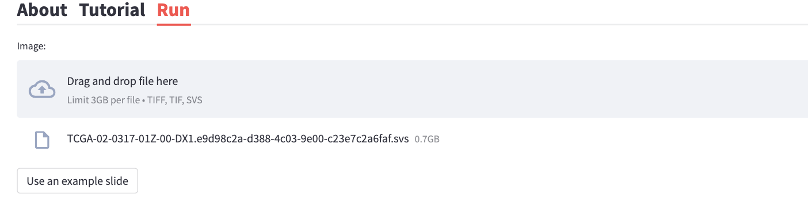
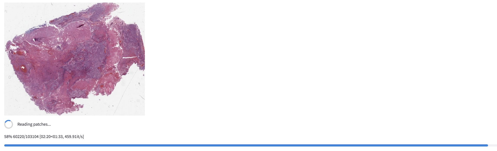
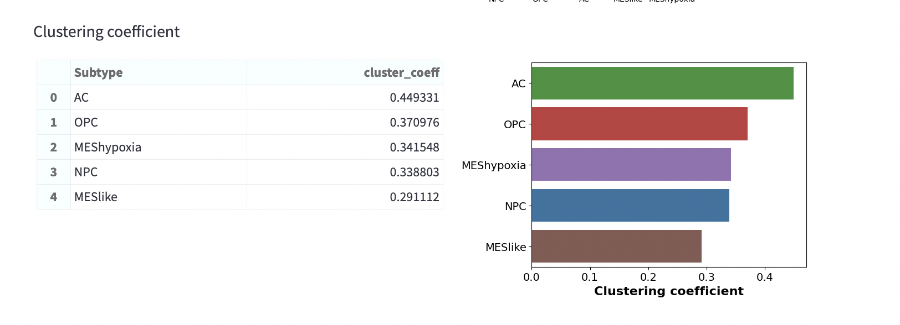
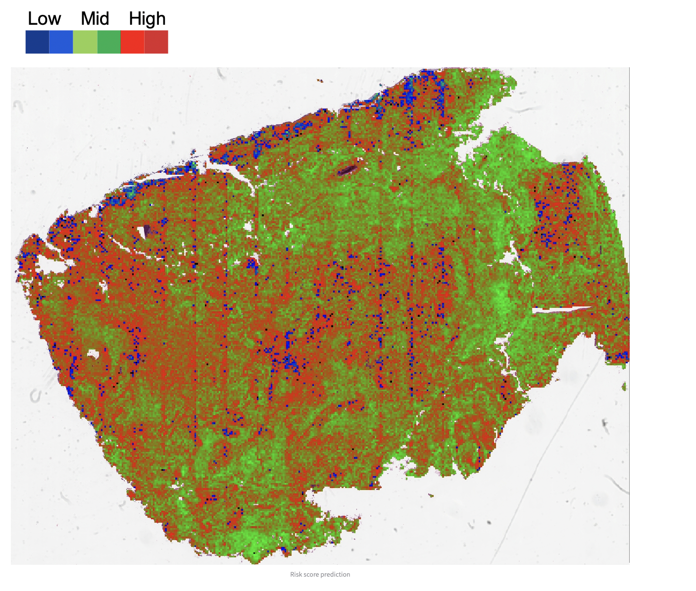

## GBM360 software ##

GBM360 is a software that harnesses the power of machine learning to investigate the cellular heterogeneity and spatial architecture of glioblastoma (GBM).  
The software takes H&E-stained histology image as input and predicts the distribution of transcriptional subtype and aggressiveness of GBM cells. 

A fully functional software is available at: https://gbm360.stanford.edu.

 

## System requirements ##

The software is written with [Streamlit](https://streamlit.io/) (V 1.12). Software dependencies can be found in `requirements.txt`

 

## Reference / Citation ##
Zheng, Y., Carrillo-Perez, F., Pizurica, M. et al. Spatial cellular architecture predicts prognosis in glioblastoma. Nat Commun 14, 4122 (2023). https://doi.org/10.1038/s41467-023-39933-0

## Installation ##

This repository contains the source code of GBM360 for demonstration purpose only. 
1. Clone this Git repository:  
`git clone https://github.com/gevaertlab/GBM360.git` to your local file system. 

2. Create a new conda environment:  
`conda create --name GBM360 python=3.9` and activate: `conda activate GBM360`

3. Install the required packages:  
`pip install -r requirements.txt`

 

## Instructions for use ##

1. Visit [https://gbm360.stanford.edu](https://gbm360.stanford.edu) in a web browser.
2. Click the `Run` tab located at the top of the page.
3. To start the analysis, user can either upload a new histology image or simply click `Use an example slide`.  
    **Note**: 
    - We currently support images saved in *tif*, *tiff* or *svs* format.  
    - Ideally, the image should be scanned at 20X magnification with a pixel resolution of 0.5um / pixel.

A thumbnail of the image will display when the upload is complete

4. Select the mode for running the job.  
    **Note**: 
    
    - The default mode is set to the `Test mode`, which will only predicts a limited portion of the image (1,000 patches). This is meant to speed up the process by generating a quick preview of the results. 
    - To predict the entire image, please switch to `Complete` mode.
    - We are currently working on obtaining GPU support for this software, which will significantly accelerate its performance.
    

 

5. Click the `Get cell type visualization` button to predict the spatial distribution of transcriptional subtype for tumor cells.

The image will be colored by the predicted transcriptional subtype:

 

6. Based on the spatial subtype prediction, the software will automatically make several statistical analysis to quantify subtype compositions and spatial cellular organization:

    (1) Subtype fraction

    

     

    (2) Subtype interaction

    

     

    (3) Clustering coefficient 

    

 

6. Finally, click the `Get prognosis visualization` button to predict the aggressive score of the cells. 

Blue indicates low aggressiveness, while Red indicates high aggressiveness

## Preprocessing codes ##

Data from 10X Genomics were first converted into Seurat or AnnData object using the Seurat or Scanpy package. 

1. Quality control and data integration were performed using the Seurat package: `quality_control.R`.
2. Run `inferCNV.py` to infer copy number variation using transcriptomics profiles. 
3. Run `tumor_frac.py` to infer tumor cell fraction for each spot based on the CNV profiles. 

