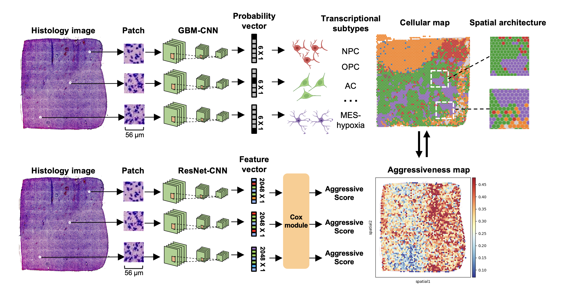
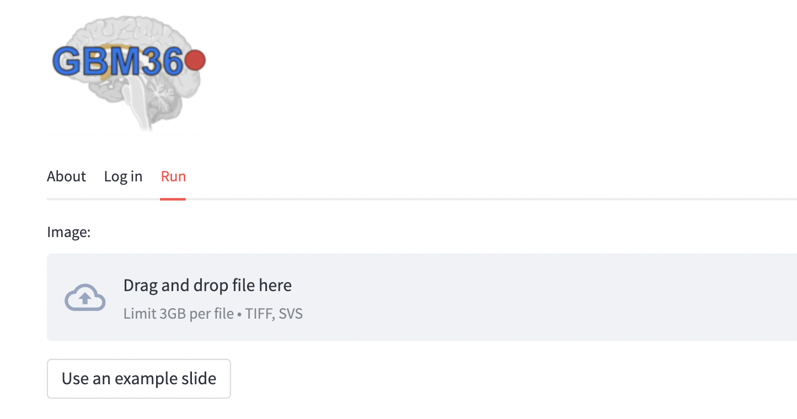
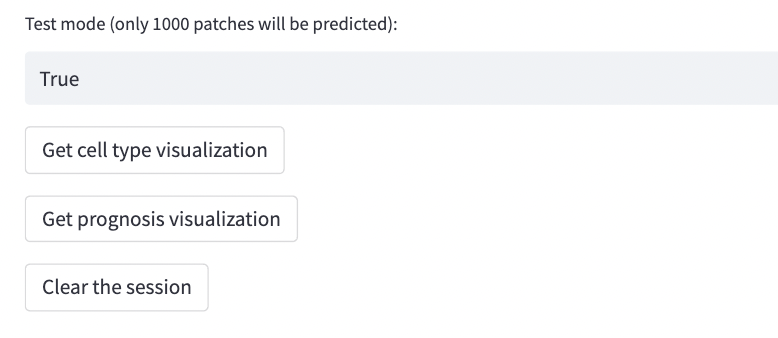
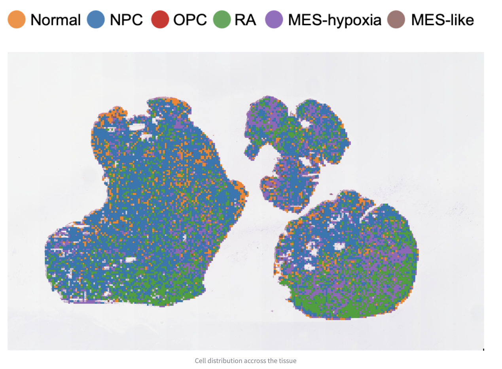
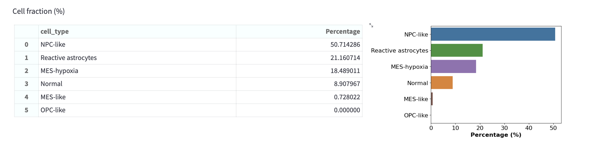
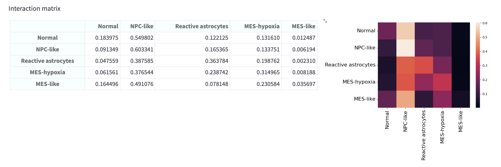
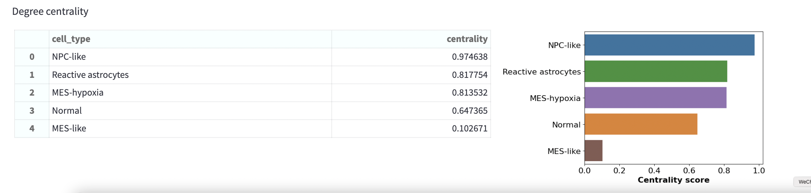

## GBM360 software ##

GBM360 is a software that uses machine learning to resolve the intra-tumoral heterogeneity and spatial cellular architecture of glioblastoma (GBM). 

A fully functional software can be tested from https://gbm360.stanford.edu.

## System requirements ##

The software was written with [Streamlit](https://streamlit.io/) (V 1.12). Software dependencies can be found in `requirements.txt`

## Installation ##

A fully functional software can be used from https://gbm360.stanford.edu. No installation is required. 

This repository contains the source code for demonstration purpose. For local access, first clone this git repository: `git clone https://github.com/gevaertlab/GBM360.git`

Create a new conda environment: `conda create --name GBM360 python=3.9` and activate: `conda activate GBM360`

Install the required packages: `pip install -r requirements.txt`

## Instructions for use ##

A fully functional software can be used from https://gbm360.stanford.edu. To upload a new histology slide or use an example slide, click the `run` option (see the `Demo` section below).

For local access, clone this git repository and install the software following the instructions in the `Installation` section.

Open the Terminal and change the working directory to the cloned repository: `cd GBM360`

Run the command: `streamlit run src/main_app.py`

The software will pop up in the user's web browser. 

## Demo ## 

Visit https://gbm360.stanford.edu in a web browser, then click the `run` option. 

Use an example slide by clicking the button `use an example slide` or uploading a new slide by using the file uploader. The slide needs to be in *tiff* or *svs* format. 
Ideally the image should be scanned at a 20X magnification with a pixel resolution of 0.5um / pixel. 

The default mode is the "Test mode". With the test mode, predictions will only be made on a limited portion of image (1,000 patches). This is designed for demonstration and software testing. 
We on working on getting a GPU support for running the software using the web server. With the GPU support, a whole-slide image can be predicted within minutes.

Click the `Get cell type visulization` button will generate the cell-type predictions and spatial visulization:

Based on the spatial cell-type prediction, the software makes several statitical analysis that quantify cell-type compositions and spatial cellular organization:

(1) cell fractions

(2) cellular interactions

(3) degree centrality

